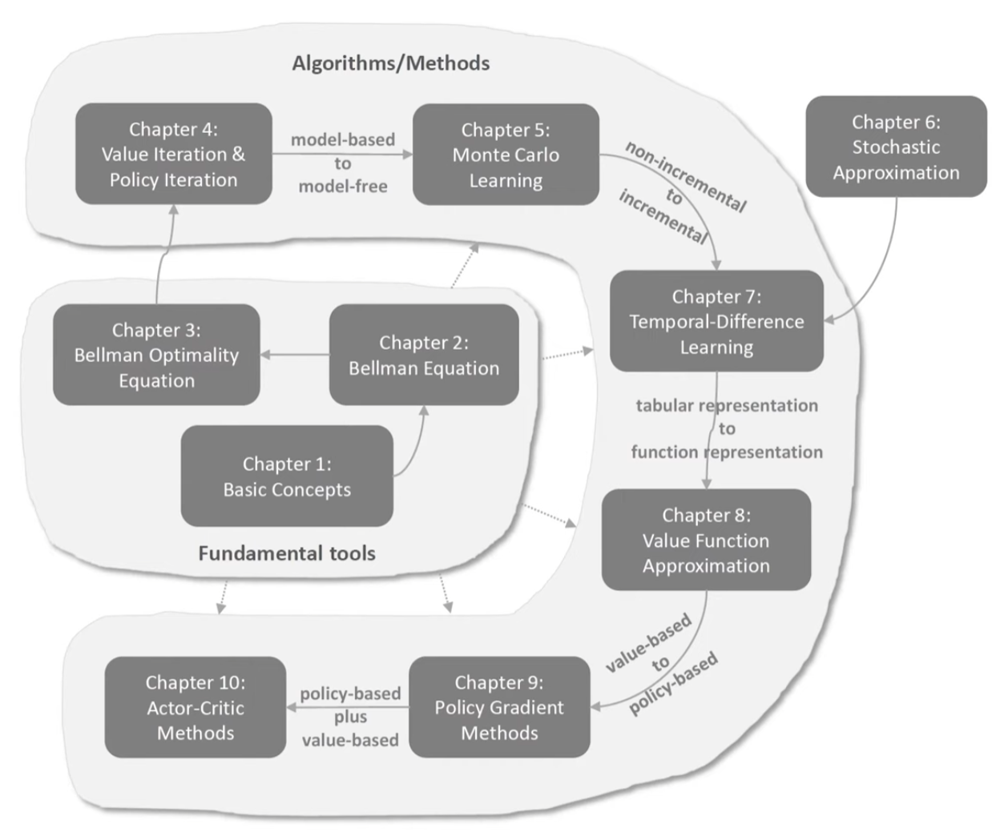

# Reinforcement learning

Reference: Mathematical Foundations of Reinforcement Learning course (WINDY Lab) on BiliBili

# Algorithm Introduction Video

[在新窗口中播放短片](./强化学习_全章节_五分钟短片.html)

<iframe
  src="./强化学习_全章节_五分钟短片.html"
  width="100%"
  height="700"
  style="border:none;">
</iframe>

## Outline

**Mathematical Foundations of Reinforcement Learning course on Youtube**

[Basic concepts and Markov decision process](<./chapter_01/Basic concepts and Markov decision process 2543a70db6ad802eb0edd11e5f40be3e.md>)

[State Values and Bellman Equation](<./chapter_02/State Values and Bellman Equation 2553a70db6ad803c86b2d1aa783b00b3.md>)

[Optimal State Values and Bellman optimality Equation](<./chapter_03/Optimal State Values and Bellman optimality Equati 25b3a70db6ad8097b25cf58aeed197e3.md>)

[Value iteration algorithm (Dynamic programming, model-based)](<./chapter_04/Value iteration algorithm (Dynamic programming, mo 25e3a70db6ad80c1a0b2d03429140a35.md>)

[Monte Carlo Learning (Model-free)](<./chapter_05/Monte Carlo Learning (Model-free) 2623a70db6ad801b83f0cf1d985b4bb9.md>)

[Stochastic Approximation and Stochastic Gradient Descent](<./chapter_06/Stochastic Approximation and Stochastic Gradient D 26c3a70db6ad80dd8cdbfc598f8e32f3.md>)

[Temporal-Difference Learning](<./chapter_07/Temporal-Difference Learning 2763a70db6ad8026b8d1daba8e41b6ba.md>)

[Value Function Methods](<./chapter_08/Value Function Methods 35e3a70db6ad8013855fd41edf1e3462.md>)

[Policy Gradient Methods](<./chapter_09/Policy Gradient Methods 3e23a70db6ad8027bd9cf64282779a7c.md>)

[Actor-Critic Methods](<./chapter_10/Actor-Critic Methods 3e43a70db6ad80029e20e2bdde67b624.md>)
