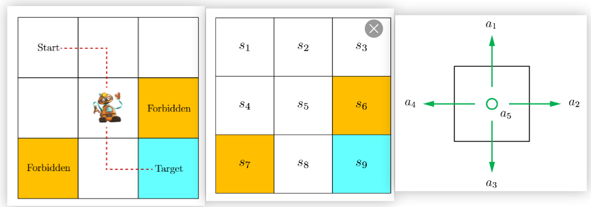

# Basic concepts and Markov decision process

## A grid world example

Robot moves in a grid world

**Task description**: Control a robot to move form Start gird to the Target grid, avoid moving out of the boarder and into the Forbidden grid.

## Concepts:

**State 状态**: describes the agent’s status with respect to the environment. 

**State space 状态空间**: set of all states, denoted as $S=\{s_{1}, s_{2}, ... s_{9}\}$.

**Action 动作**: possible actions that agent can take.

**Action space 动作空间**:  set of all actions, denoted as $A=\{a_1, a_2, ..., a_5 \}$.

**State transition 状态转移**:

The agent at $s_1$ takes $a_2$ will experience such process

$$
 s_1 \xrightarrow{a_2} s_2.
$$

However, due to other external causals, such as wind blowing, the robot is possible to be blowed to more distant gird, like $s_3$. So it’s practical to use conditional probability to describe the process, which is called *stochastic* state transition. 状态转移可以用条件概率来描述

$$
p(s_1 | s_1, a_2) = 0.5, \\ p(s_3 | s_1, a_2) = 0.5, \\ p(s_2 | s_1, a_2) = 0, \\ p(s_4 | s_1, a_2) = 0.
$$

For simplicity, we only consider the *deterministic* state transitions in the grid world examples.

**Policy 策略**: 

tells the agent which actions to take at every state. Mathematically, policies can be described by conditional probabilities, denoted as $\pi (a|s)$, which is a conditional probability distribution function defined for *every* state. 每个状态的策略可以用条件概率来描述

Policy can be categorized as deterministic and stochastic policies.

Left: deterministic policy. Right: stochastic policy

**Reward 奖励:** 

After executing an action at a state, the agent obtains a reward, denoted as $r$, as feedback from the environment. The reward is a funtion of the state $s$ and action $a$, denoted as $r(s, a)$. 奖励是关于状态和动作的函数 

A reward can be interpreted as a human-machine interface, with which we can guide the agent to behave as we expect. 奖励可以视作人机交互接口

Its value is a real number. We can also describe reward using conditional probability function: 

$$
p(r=-1|s_1, a_1)=1, p(r\neq-1 | s_1,a_1)=0.
$$

Reward can also be deterministic and stochastic. 奖励也可以用条件概率来描述

**Trajectories, returns and episodes 轨迹，回报和回合**:

A *trajectory* is a state-action-reward chain:

$$
s_1 \xrightarrow[r=0]{a_2} s_2 \xrightarrow[r=0]{a_3} s_5 \xrightarrow[r=0]{a_3} s_8 \xrightarrow[r=1]{a_2} s_9.
$$

The *return* of this trajectory is defined as the sum of all the rewards collected along the trajectory:

$$
return=0+0+0+1=1.
$$

Returns can be used to *evaluate* policies. 回报可以用于评估策略的好坏

*Discount rate* is bounded with *discount return*:

$$
\text{discounted return} = 0 + \gamma 0 + \gamma^2 0 + \gamma^3 1 + \gamma^4 1 + \gamma^5 1 + \dots,
$$

where $\gamma \in (0,1)$ is called discount rate. It can be used to adjust the emphasis placed on near- or far-future rewards.

**Episode 回合，即有明确终止条件的有限长轨迹**: An *episode*(also called a trial) is usually assumed to be a finite trajectory(a trajectory with a terminal states). Tasks with episodes are called *episodic tasks*. Oppositely, tasks with no terminal states are called *continuing tasks*. They can be treated in unified mathematical manner by converting episodic tasks to continuing ones (check in book’s page 10). 有限的回合型任务可以通过恰当的任务设计转化为无限的连续型任务

### Note:

**State transition, Policy and Reward all** can be ****deterministic and stochastic, and stochastic versions represents a more complicated condition. We can use s-a tabular to show a specified case of all three concepts.

## Markov decision processes 马尔可夫决策过程

### Key ingredients:

- Sets:
    - State space: $S$
    - Action space: $A(s)$
    - Reward set: $R(s, a)$
- Model:
    - State transition probability: $p(s' | s, a)$
    - Reward probability: $p(r|s, a)$
- Policy: $\pi(a|s)$
- *Markov property 马尔可夫性质*: refers to the memoryless property of a stochastic process. Mathematically, it means that:

$$
p(s_{t+1}|s_t, a_t, s_{t-1}, a_{t-1}, \dots, s_0, a_0) = p(s_{t+1}|s_t, a_t), \\p(r_{t+1}|s_t, a_t, s_{t-1}, a_{t-1}, \dots, s_0, a_0) = p(r_{t+1}|s_t, a_t),
$$

where $t$ represents the current time step. Equations above indicates that the next state or reward depends merely on the current state and action and is dependent of the previous ones.

### Markov process 马尔可夫过程

Difference between MDP and MP: MP is the version of MDP with fixed policy.

## QA

