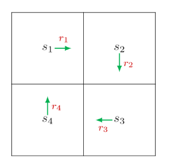

# State Values and Bellman Equation

## Motivating example: How to calculate returns?

A grid world example

we can describe the return of each state based on the idea of *bootstrapping*.

$$
\underbrace{\begin{bmatrix} v_1 \\ v_2 \\ v_3 \\ v_4 \end{bmatrix}}_{v}=\begin{bmatrix} r_1 \\ r_2 \\ r_3 \\ r_4 \end{bmatrix}+\begin{bmatrix} \gamma v_2 \\ \gamma v_3 \\ \gamma v_4 \\ \gamma v_1 \end{bmatrix}=\underbrace{\begin{bmatrix} r_1 \\ r_2 \\ r_3 \\ r_4 \end{bmatrix}}_{r}+ \gamma\underbrace{\begin{bmatrix} 0 & 1 & 0 & 0 \\ 0 & 0 & 1 & 0 \\ 0 & 0 & 0 & 1 \\ 1 & 0 & 0 & 0 \end{bmatrix}}_{P}\underbrace{\begin{bmatrix} v_1 \\ v_2 \\ v_3 \\ v_4 \end{bmatrix}}_{v},
$$

which can be written compactly as

$$
v = r + \gamma Pv.
$$

This is the Bellman equation for this simple example. It demonstrates the core idea of the Bellman equation: the return obtained by starting from one state depend on those obtained when starting from other states.

## States values 状态值

At time $t$, the agent is in state $S_t$, and the action taken following a policy $\pi$ is $A_t$. The next state is $S_{t+1}$, and the immediate reward obtained is $R_{t+1}$:

$$
S_t \xrightarrow{A_t} S_{t+1}, R_{t+1}.
$$

Following this, we can obtain a state-action-reward trajectory: 

$$
S_t \xrightarrow{A_t} S_{t+1}, R_{t+1} \xrightarrow{A_{t+1}} S_{t+2}, R_{t+2} \xrightarrow{A_{t+2}} S_{t+3}, R_{t+3} \dots
$$

Discounted return along the trajectory is:

$$
G_t \doteq R_{t+1} + \gamma R_{t+2} + \gamma^2 R_{t+3} + \dots,
$$

*State value*(or *state value function*) can be defined as:

$$
v_\pi(s) \doteq \mathbb{E}[G_t|S_t=s].
$$

### Note:

When the policy and the system model are deterministic, *return* is equal to the *state value*.

## Bellman equation 贝尔曼方程

A mathematical tool for analyzing state values. It’s a set of linear equations that describe the relationships between state values.

Key deriveations:

$$
\begin{align*}v_\pi(s) &= \mathbb{E}[G_t|S_t=s] \\&= \mathbb{E}[R_{t+1} + \gamma G_{t+1}|S_t=s] \\&= \mathbb{E}[R_{t+1}|S_t=s] + \gamma \mathbb{E}[G_{t+1}|S_t=s].\\& s.t. \mathbb{E}[aX + bY] = a\mathbb{E}[X] + b\mathbb{E}[Y]\end{align*}
$$

$\mathbb{E}[R_{t+1}|S_t=s]$ is the expectation of the *immediate rewards*:

$$
\begin{align*}\mathbb{E}[R_{t+1}|S_t=s] &= \sum_{a \in A} \pi(a|s) \mathbb{E}[R_{t+1}|S_t=s, A_t=a] \\&= \sum_{a \in A} \pi(a|s) \sum_{r \in R} p(r|s, a)r.\end{align*}
$$

$\mathbb{E}[G_{t+1}|S_t=s]$ is the expectation of the *future rewards*:

$$
\begin{align*}\mathbb{E}[G_{t+1}|S_t=s] &= \sum_{s' \in S} \mathbb{E}[G_{t+1}|S_t=s, S_{t+1}=s']p(s'|s) \\&= \sum_{s' \in S} \mathbb{E}[G_{t+1}|S_{t+1}=s']p(s'|s) \quad \text{(due to the Markov property)} \\&= \sum_{s' \in S} v_\pi(s')p(s'|s) \\&= \sum_{s' \in S} v_\pi(s') \sum_{a \in A} p(s'|s,a)\pi(a|s).\end{align*}
$$

There is another deduction logic:

$$
\begin{align*}\mathbb{E}[G_{t+1}|S_t=s] &= \sum_{a \in A} \pi(a|s)  \sum_{s' \in S} p(s'|s,a)v_\pi(s').\end{align*}
$$

It is based on the idea that if we want to solve the expectation of $G_{t+1}$ on condition $S_t = s$, we have to figure out the probabilty of taking action $a$ on policy $\pi$ and transfering to state $s'$ on action $a$. Then what we need to do is to sum them all and get the expectation value.

Substituting:

$$
\begin{align*}v_\pi(s) &= \mathbb{E}[R_{t+1}|S_t=s] + \gamma \mathbb{E}[G_{t+1}|S_t=s], \\&= \underbrace{\sum_{a \in A} \pi(a|s) \sum_{r \in R} p(r|s,a)r}_{\text{mean of immediate rewards}} + \gamma \underbrace{\sum_{a \in A} \pi(a|s) \sum_{s' \in S} p(s'|s,a)v_\pi(s')}_{\text{mean of future rewards}} \\&= \sum_{a \in A} \pi(a|s) \left[ \sum_{r \in R} p(r|s,a)r + \gamma \sum_{s' \in S} p(s'|s,a)v_\pi(s') \right], \quad \text{for all } s \in \mathcal{S}.\end{align*}
$$

This equation is just the *Bellman equation*.

## Note:

1. Bellman equation refers to a set of linear equations for all states rather than a singlee equation.
2. Solving the state value from the Bellman equation is a *policy evaluation 策略估计* process.
3. $p(r|s,a)r$ and $p(s'|s,a)$ represent the system model 系统模型.

## Matrix-vector form of the Bellman equation 贝尔曼方程的矩阵形式

Rewrite the Bellman equation:

$$
v_\pi(s) = r_\pi(s) + \gamma \sum_{s' \in S} p_\pi(s'|s)v_\pi(s'),
$$

where

$$
\begin{align*}r_\pi(s) &\doteq \sum_{a \in A} \pi(a|s) \sum_{r \in R} p(r|s,a)r, \\p_\pi(s'|s) &\doteq \sum_{a \in A} \pi(a|s)p(s'|s,a).\end{align*}
$$

$r_{\pi}(s)$ denotes the mean of the immediate rewards, and $p_{\pi}(s'|s)$ is the probability of transitioning from $s$ to $s'$ under policy $\pi$.

Suppose index

$$
v_\pi(s_i) = r_\pi(s_i) + \gamma \sum_{s_j \in S} p_\pi(s_j|s_i)v_\pi(s_j).
$$

Let $v_\pi = [v_\pi(s_1), \dots, v_\pi(s_n)]^T \in \mathbb{R}^n$, $r_\pi = [r_\pi(s_1), \dots, r_\pi(s_n)]^T \in \mathbb{R}^n$, and $P_\pi \in \mathbb{R}^{n \times n}$ with $[P_\pi]_{ij} = p_\pi(s_j|s_i)$. Then, we get the matrix-vector form:

$$
v_\pi = r_\pi + \gamma P_\pi v_\pi,
$$

where $v_\pi$ is  the unknown to be solved, and $r_\pi, P_\pi$are known.

## Solving state values from the Bellman equation

### Closed-form solution

$$
v_\pi = (I - \gamma P_\pi)^{-1}r_\pi.
$$

### Iterative solution 数值计算中的迭代法

$$
v_{k+1} = r_\pi + \gamma P_\pi v_k, \quad k=0, 1, 2, \dots
$$

$$
v_k \to v_\pi = (I - \gamma P_\pi)^{-1}r_\pi, \quad \text{as } k \to \infty.
$$

Convergence proof of iterative solution

## From state value to action value 状态值到动作值

The action value of a state-action pair $(s,a)$ is defined as

$$
q_\pi(s, a) \doteq \mathbb{E}[G_t|S_t=s, A_t=a].
$$

It’s defined as the expected return that can be obtained after taking an action at a state.

Relationship between action values and state values:

$$
\underbrace{\mathbb{E}[G_t|S_t=s]}_{v_\pi(s)} = \sum_{a \in A} \underbrace{\mathbb{E}[G_t|S_t=s, A_t=a]}_{q_\pi(s,a)} \pi(a|s).
$$

$$
v_\pi(s) = \sum_{a \in A} \pi(a|s)q_\pi(s,a).
$$

$$
q_\pi(s,a) = \sum_{r \in \mathcal{R}} p(r|s,a)r + \gamma \sum_{s' \in \mathcal{S}} p(s'|s,a)v_\pi(s').
$$

It can also be treated as the sum of the immediate reward plus the future reward.

### Note:

1. The Bellman equation can also be written in terms of action values.