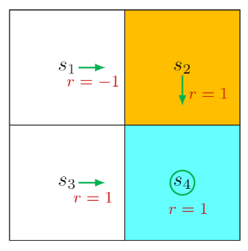

# Optimal State Values and Bellman optimality Equation

## Motivating example: How to improve policies?

grid example

Intuition: at $s_1$, $a_3$ is better than $a_2$ because of the exitence of forbidden area.

Mathematics: Bellman equation of this policy is: 

$$
\begin{align*}v_{\pi}(s_1) &= -1 + \gamma v_{\pi}(s_2), \\v_{\pi}(s_2) &= +1 + \gamma v_{\pi}(s_4), \\v_{\pi}(s_3) &= +1 + \gamma v_{\pi}(s_4), \\v_{\pi}(s_4) &= +1 + \gamma v_{\pi}(s_4).\end{align*}
$$

let $\gamma=0.9$, then:

$$
\begin{align*}v_{\pi}(s_4) &= v_{\pi}(s_3) = v_{\pi}(s_2) = 10, \\v_{\pi}(s_1) &= 8.\end{align*}
$$

Action value of $s_1$ is:

$$
\begin{align*}q_{\pi}(s_1, a_1) &= -1 + \gamma v_{\pi}(s_1) = 6.2, \\q_{\pi}(s_1, a_2) &= -1 + \gamma v_{\pi}(s_2) = 8, \\q_{\pi}(s_1, a_3) &= 0 + \gamma v_{\pi}(s_3) = 9, \\q_{\pi}(s_1, a_4) &= -1 + \gamma v_{\pi}(s_1) = 6.2, \\q_{\pi}(s_1, a_5) &= 0 + \gamma v_{\pi}(s_1) = 7.2.\end{align*}
$$

Obviousely, $a_3$ has the greatest action value, so we can update the policy to select $a_3$ at $s_1$.

## Optimal state values and optimal policies 最优状态值和最优策略

**Definition 3.1** (Optimal policy and optimal state value). A policy $\pi^*$ is optimal if $v_{\pi^*}(s) \geq v_{\pi}(s)$ for all $s \in S$ and for any other policy $\pi$. The state values of $\pi^*$ are the optimal state values.

## Bellman optimality equation 贝尔曼最优方程

Bellman optimality equation(BOE) is the tool for analyzing optimal policies and optimal state values.

For every $s \in S$, the elementwise expression of the BOE is

$$
\begin{align*}v(s) &= \max_{\pi(s) \in \Pi(s)} \sum_{a \in A} \pi(a|s) \left( \sum_{r \in R} p(r|s,a)r + \gamma \sum_{s' \in S} p(s'|s,a)v(s') \right) \\&= \max_{\pi(s) \in \Pi(s)} \sum_{a \in A} \pi(a|s)q(s,a),\end{align*}
$$

where $v(s), v(s')$ are unkown variables to be solved and

$$
q(s, a) \doteq \sum_{r \in R} p(r|s, a)r + \gamma \sum_{s' \in S} p(s'|s, a)v(s').
$$

## Maxtimization of the right-hand side of the BOE

From two examples we can learn how to solve the optimal equation like BOE:

Two variables example

Sum of terms example

So we can choose to solve $\pi(a|s)$ firstly like example 3.1, and then solve it like example 3.2:

$$
\sum_{a \in A} \pi(a|s)q(s,a) \le \sum_{a \in A} \pi(a|s) \max_{a \in A} q(s,a) = \max_{a \in A} q(s,a),
$$

where equality is achieved when

$$
\pi(a|s) = \begin{cases} 1, & a = a^*, \\0, & a \neq a^*.\end{cases}
$$

$a^* = \arg\max_a q(s, a).$ So $\pi(s)$ is the one that selects the action that has the greatest value of $q(s,a)$.

## Matrix-vector form of the BOE

BOE refers to a set of equations defined for all states. The matrix-vector form of the BOE is

$$
v = \max_{\pi \in \Pi} (r_{\pi} + \gamma P_{\pi} v),
$$

where $v \in \mathbb{R}^{|S|}$ and $max_{\pi}$ is performed in an elementwise manner.

Right-hand side of the below funtion is a function of $v$, denoted as

$$
f(v) \doteq \max_{\pi \in \Pi} (r_{\pi} + \gamma P_{\pi} v).
$$

Then, the BOE can be expressed as

$$
v = f(v)
$$

## Contraction mapping theorem 压缩映射定理

A point $x^*$ is called a *fixed point* if

$$
f(x^*) = x^*,
$$

where $x \in \mathbb{R}^{d}$, and $f:\mathbb{R}^{d} \rightarrow \mathbb{R}^{d}$.

The funtion $f$ is a *contraction mapping* if there exists $\gamma \in (0,1)$ such that

$$
\| f(x_1) - f(x_2) \| \le \gamma \| x_1 - x_2 \|,
$$

for any $x_1, x_2 \in \mathbb{R}^{d}$. Here, $\| \cdot \|$ denotes a vector or matrix norm.

Some examples:

Examples of fixed point and contraction mapping

**Theorem 3.1** (Contraction mapping theorem). For *any equation* that has the form $x=f(x)$ where $x$ and $f(x)$ are real vectors, if $f$ is a *contraction mapping*, then the *following properties* hold.

- Existence: There exists a fixed point $x^*$ satisfying $f(x^*) = x^*$ .
- Uniqueness: The fixed point $x^*$ is unique.
- **Algorithm**: Consider the iterative process:

$$
x_{k+1} = f(x_{k}),
$$

where $k=0,1,2,...$ Then, $x_k \rightarrow x^*$ as $k \rightarrow \infin$ for any initial guess $x_0$. Moreover, the convergence rate is exponentially fast. If we can proove that BOE satisfies Contraction mapping theorem, we could utilize this theorem to solve it. Luckily, **this is just the theoretical support of value iteration method to solve BOE.**

Proof of Contraction mapping theorem is difficult mathematically, could skip.

## Contraction property of the right-hand side of the BOE 收缩性质

**Theorem 3.2** (Contraction property of $f(v)$ ). The function $f(v)$ on the right-hand side of the BOE is a contraction mapping. In particular, for any $v_1, v_2 \in \mathbb{R}^{d}$, it holds that

$$
\| f(v_1) - f(v_2) \|_{\infty} \le \gamma \| v_1 - v_2 \|_{\infty},
$$

where $\gamma \in (0,1)$ is the discount rate, and $\| \cdot \|_{\infty}$ is the maximum norm, which is the maximum absolute value of the elements of a vector.

## Solving an optimal policy from the BOE

- Solving optimal state value $v^*$: If $v^*$ is the solution of the BOE, then it satisfies

$$
v^* = \max_{\pi \in \Pi} (r_{\pi} + \gamma P_{\pi} v^*).
$$

Clearly, $v^*$ is a fixed point because $v^* = f(v^*)$. Then, the contraction mapping theorem suggests the following results. 每次迭代时 $\pi$都会根据状态值的当前值重新计算，以使等式右侧最大，而不是以固定的策略进行全部的迭代

**Theorem 3.3** (Existence, uniqueness, and algorithm). For the BOE $v=f(v)=max_{\pi}(r_{\pi}+\gamma P_{\pi}v_{k})$, there always exists a unique solution $v^*$, which can be solved iteratively by

$$
v_{k+1} = f(v_k) = \max_{\pi \in \Pi} (r_\pi + \gamma P_\pi v_k), \quad k = 0, 1, 2, \ldots
$$

The value of $v_k$ converges to $v^*$ exponentially fast as $k \rightarrow \infin$ given any initial guess $v_0$.

It answers some fundamental questions:

Existence of $v^*$; Uniqueness of $v^*$ ; Algorithm for solving $v^*$ (based on Theorem 3.3, also called *value iteration*)

- Solving $\pi^*$: Once the value of $v^*$ has been obtained, we can easily obtain $\pi^*$ by solving

$$
\pi^* = \arg \max_{\pi \in \Pi} (r_\pi + \gamma P_\pi v^*).
$$

The value of $\pi^*$ will be given in **Theorem 3.5** later. Substituting:

$$
v^* = r_{\pi^*} + \gamma P_{\pi^*} v^*
$$

$v^* = v_{\pi}$ is the state value of $\pi^*$. Till now, we have solved $v^*$ and $\pi^*$, but it’s still unclear whether they are optimal.

**Theorem 3.4** (Optimality of $v^*$ and $\pi^*$) The solution $v^*$ is the optimal state value, and $\pi^*$ is an optimal policy. That is, for any policy $\pi$, it holds that

$$
v^* = v_{\pi^*} \geq v_\pi.
$$

**Theorem 3.5** (Greedy optimal policy). For any $s \in S$, the deterministic greedy policy

$$
\pi^*(a|s) = 
\begin{cases} 
1, & a = a^*(s), \\
0, & a \neq a^*(s),
\end{cases}
$$

is an optimal policy for solving the BOE. Here, 

$$
a^*(s) = \arg \max_{a} q^*(a, s),
$$

where

$$
q^*(s, a) \doteq \sum_{r \in \mathcal{R}} p(r|s, a)r + \gamma \sum_{s' \in \mathcal{S}} p(s'|s, a)v^*(s').
$$

Check the head of this notion to understand this proof.

- Optimal policy $\pi^*$ is not unique for a unique $v^*$.
- An optimal policy can be either stochastic or deterministic.

## Factors that influence optimal policies

- discount rate
- reward values, not always

**Theorem 3.6** (Optimal policy invariance). If $r \in R$ is changed by an affine transformation to $\alpha r + \beta$, then the corresponding optimal state value $v'$ is also an affine transformation of $v^*$:

$$
v' = \alpha v^* + \frac{\beta}{1 - \gamma} \mathbf{1},
$$

and optimal policy $\pi^*$ is invariant to this transformation.

### Note:

1. We can just set zero value instead of negative value to avoid detour in grid world example, due to the joint impact on state value of both reward and discout rate.