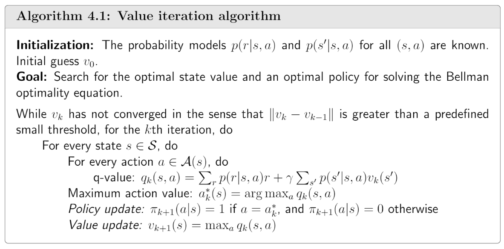

# Value iteration algorithm (Dynamic programming, model-based)

## Value iteration

It is exactly the algorithm suggested by the [contraction mapping theorem](https://app.notion.com/p/State-Values-and-Bellman-Equation-2553a70db6ad803c86b2d1aa783b00b3?pvs=21) for solving the Bellman optimality equation, as introduced in the last chapter.

In particular, the algorithm is

$$
v_{k+1} = \max_{\pi \in \Pi} (r_\pi + \gamma P_\pi v_k), \quad k = 0, 1, 2, \dots
$$

Theorem 3.3 guarantes $v_k$  and $\pi_k$ converge to the optimal state value and optimal policy as  $k \rightarrow \infin$.

This algorithm is iterative and has two steps in every iteration.

1. *policy update* step: it aims to find a policy that satisfies:

$$
\pi_{k+1} = \arg\max_{\pi} (r_\pi + \gamma P_\pi v_k),
$$

where $v_k$ is obtained in the previous iteration and can be initialized randomly.

1. *value update* step: it calculate a new value $v_{k+1}$ by

$$
v_{k+1} = r_{\pi_{k+1}} + \gamma P_{\pi_{k+1}} v_k,
$$

Above is the matrix-vector form. To understand how to implement this algorithm, we need to further examine its elementwise form.

### Elementwise form and implementation

1. *policy update* step:

$$
\pi_{k+1}(s) = \arg\max_{\pi} \sum_a \pi(a|s) \underbrace{\left( \sum_r p(r|s,a)r + \gamma \sum_{s'} p(s'|s,a)v_k(s') \right)}_{q_k(s,a)}, \quad s \in \mathcal{S}.
$$

solution is:  $\pi_{k+1}(a|s) = \begin{cases} 1, & a = a_k^*(s), \\ 0, & a \neq a_k^*(s), \end{cases}$ , where $a_k^*(s) = \arg\max_a q_k(s, a).$ (*greedy*)

1. *value update* step:

$$
v_{k+1}(s) = \sum_a \pi_{k+1}(a|s) \underbrace{\left( \sum_r p(r|s,a)r + \gamma \sum_{s'} p(s'|s,a)v_k(s') \right)}_{q_k(s,a)}, \quad s \in \mathcal{S}.
$$

substituting by results from policy update:

$$
v_{k+1}(s) = \max_a q_k(s, a)
$$

In summary, the above steps can be illustrated as:

$v_k(s) → q_k(s, a) →$ new greedy policy $π_{k+1}(s) →$ new value $v_{k+1}(s) = max_a q_k(s, a)$

### Note:

1. $v_k$ here in the value iteration algorithm is not a state value due to it does not satisfy the Bellman function.

## Policy iteration 策略迭代

补充：gemini说，策略迭代之所以比值迭代快，根本原因是因为值迭代只有一次的收敛速度，而策略迭代具有二次的收敛速度。可以证明，策略迭代是一种牛顿迭代法，其中进行策略估计的步骤本质上计算了贝尔曼最优方程的导数；注意，虽然策略迭代收敛速度更快，但是这一算法中求解矩阵的逆的过程多引入了一层迭代，因此实际计算效率并没有那么快

Policy iteration is also an iterative algorithm. Each iteration has two steps.

1. *policy evaluation* step: it evaluates a given policy by calculating the corresponding state value:

$$
v_{\pi_k} = r_{\pi_k} + \gamma P_{\pi_k} v_{\pi_k},
$$

where $\pi_k$ is the policy obtained in the last iteration, which can be initialized with a random guess $\pi_0$. $r_{\pi_k}$ and $P_{\pi_k}$ can be obtained from the system model.

This equation can be sloved by a closed-form solution $v_{\pi_k} = (I - \gamma P_{\pi_k})^{-1} r_{\pi_k}$. Or utilize a iterative algorithm in practise:

$$
v_{\pi_k}^{(j+1)} = r_{\pi_k} + \gamma P_{\pi_k} v_{\pi_k}^{(j)}, \quad j = 0, 1, 2, \dots
$$

Starting from any initial guess $v^{(0)}_{\pi_k}$, it is ensured that $v_{\pi_k}^{j} \rightarrow v_{\pi_k}$ as $j \rightarrow \infin$.

Interestingly, policy iteration is an iterative algorithm with another iterative algorithm embedded in the policy evaluation step. This point will be talked about later in truncated iteration section.

1. *policy improvement* step: a new policy $\pi_{k + 1}$ can be obtained using $v_{\pi_k}$ as:

$$
\pi_{k+1} = \arg\max_{\pi} (r_\pi + \gamma P_\pi v_{\pi_k}).
$$

### In the policy improvement step, why is $\pi_{k + 1}$ better than $\pi_k$ ?

**Lemma 4.1** (Policy improvement). If $\pi_{k+1} = \arg\max_{\pi} (r_\pi + \gamma P_\pi v_{\pi_k})$, then $v_{\pi_{k+1}} \geq v_{\pi_{k}}$.

### Why can the policy iteration algorithm eventually find an optimal policy?

**Theorem 4.1** (Convergence of policy iteration). The state value sequence $\{ v_{\pi_k} \}^{\infin}_{k=0}$ generated by the policy iteration algorithm converges to the optimal state value $v^*$. As a result, the policy sequence $\{ \pi_k \}^{\infin}_{k=0}$ converges to an optimal policy.

The proof shows that the policy iteration algorithm converges faster than the value iteration algorithm.

### Elementwiese form and implementation

1. policy evaluation step:

$$
v_{\pi_k}^{(j+1)}(s) = \sum_a \pi_k(a|s) \left( \sum_r p(r|s,a)r + \gamma \sum_{s'} p(s'|s,a)v_{\pi_k}^{(j)}(s') \right), \quad s \in \mathcal{S},
$$

where, $j = 0,1,2...$

1. policy improvement step

$$
\pi_{k+1}(s) = \arg\max_{\pi} \sum_a \pi(a|s) \underbrace{\left( \sum_r p(r|s,a)r + \gamma \sum_{s'} p(s'|s,a)v_{\pi_k}(s') \right)}_{q_{\pi_k}(s,a)}, \quad s \in \mathcal{S},
$$

use the same greedy optimal policy later.

### Note:

1. The states that are close to the target area find the optimal policies earlier than those far away, due to the greedy policy in the policy iteration algorithm. (see example in book page 69)

## Truncated policy iteration 截断策略截断

### Comparing value iteration and policy iteration

- Policy iteration: Select an arbitrary initial policy $\pi_0$. In the $k$th iteration, do the following two steps.
    - Step1: Policy evaluation (PE). $v_{\pi_k} = r_{\pi_k} + \gamma P_{\pi_k} v_{\pi_k}.$
    - Step2: Policy improvement (PI). $\pi_{k+1} = \arg\max_{\pi} (r_\pi + \gamma P_\pi v_{\pi_k}).$
- Value iteration: Select an arbitrary inital value $v_0$. In the $k$th iteration, do the following two steps.
    - Step1: Policy update (PU). $\pi_{k+1} = \arg\max_{\pi} (r_\pi + \gamma P_\pi v_k).$
    - Step2: Value update (VU). $v_{k+1} = r_{\pi_{k+1}} + \gamma P_{\pi_{k+1}} v_k,$

If two algorithms start from a same value, then we get the table:

Differece appears in the fourth step. By letting $v^{(0)}_{\pi_1} = v_0$, we have:

Then we get the truncated policy iteration algorithm:

**Proposition 4.1** (Value improvement). Consider the iterative algorithm in the policy evaluation step:

$$
v_{\pi_k}^{(j+1)} = r_{\pi_k} + \gamma P_{\pi_k} v_{\pi_k}^{(j)}, \quad j = 0, 1, 2, \dots
$$

If the inital guess is selected as $v_{\pi_k}^{(0)}=v_{\pi_{k-1}}$, it holds that

$$
v_{\pi_k}^{(j+1)} \geq v_{\pi_k}^{(j)},
$$

for $j=0,1,2,...$

This proposition shows that if $v_k$ does not equal $v_{\pi_k}$, the algorithm still able to find optimal policies.

