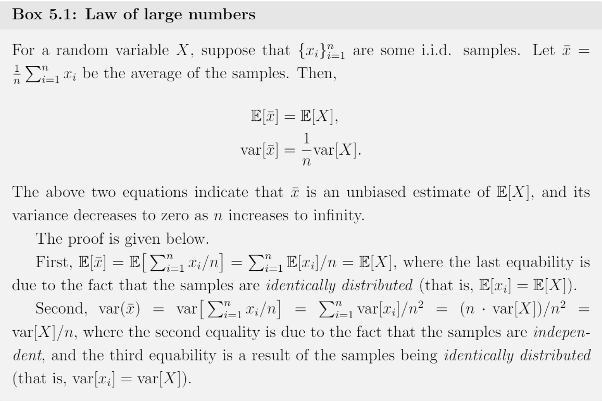

# Monte Carlo Learning (Model-free)

**Philosophy**: If we do not have a modal, we must have some data. If we do not have data, we must have a model.

## Motivating example: Mean estimation

State and action values are both defined as the mean of returns, which is a mean estimation problem.

Suppose a random variable $X$, and we want to calculate the mean value of $X: \mathbb{E}[X]$:

- *model-based*: Here model refers to the probability distribution of $X$:

$$
\mathbb{E}[X] = \sum_{x} p(x)x.
$$

- *model-free*: When the probability distribution (i.e. the model) of $X$ is unknown, suppose that we have some samples $\{ x_1, x_2, ..., x_n \}$ of $X$. Then, the mean can be approximated as

$$
\mathbb{E}[X] \approx \bar{x} = \frac{1}{n} \sum_{j=1}^{n} x_j.
$$

When $n \rightarrow \infin$, we have $\bar{x} \rightarrow \mathbb{E}[x].$ This is guaranteed by the *law of large numbers*: the average of a large number of samples is close to the expected value.

Law of large numbers.

## MC Basic: The simplest MC-based algorithm

### Converting policy iteration to be model-free

Recall that the first step of policy iteration is to calculate state value, which is used to calculate action value later. And the second step is to calculate the policy using the action value. So clearly, the action value is the key in policy iteration algorithm. Specifically, 

- model-based approach: refers to policy iteration algorithm here, after calculating the state value $v_{\pi_k}$, we can calculate the action value

$$
q_{\pi_k}(s, a) = \sum_r p(r|s, a)r + \gamma \sum_{s'} p(s'|s, a)v_{\pi_k}(s').
$$

- *model-free* approach: Return to the definition of an action value:

$$
\begin{aligned}q_{\pi_k}(s, a) &= \mathbb{E}[G_t|S_t = s, A_t = a] \\&= \mathbb{E}[R_{t+1} + \gamma R_{t+2} + \gamma^2 R_{t+3} + \dots | S_t = s, A_t = a],\end{aligned}
$$

Clearly, $q_{\pi_k}(s, a)$ is an expectation, so it can be estimated by MC methods introduced in last section. To do that, agent starting from (s, a) can interact with the environment by following policy $\pi_k$ and then obtain a certain number of episodes. Suppose that the return of the $i$th episode is $g^{i}_{\pi_k}(s, a)$, then

$$
q_{\pi_k}(s, a) = \mathbb{E}[G_t|S_t = s, A_t = a] \approx \frac{1}{n} \sum_{i=1}^{n} g_{\pi_k}^{(i)}(s, a).
$$

If the number of episodes $n$ is sufficiently large, the approximation will be sufficiently accurate according to the law of large numbers.

### The MC Basic algorithm

- Step 1: *Policy evaluation*. For every $(s, a)$, collect sufficiently many episodes and use the average of the returns, denoted as $q_{k}(s, a)$, to approximate $q_{\pi_k}(s, a)$.
- Step2: *Policy improvement*. This step solves $\pi_{k+1}(s) = \arg\max_{\pi} \sum_a \pi(a|s) q_k(s, a)$, for all $s \in S$, as the greedy optimal policy in policy iteration algorithm.

The policies and state values obtained by the MC Basic algorithm when given different episode lengths

### Note:

1. MC Basic is too simple to be pratical due to its low sample efficiency.
2. (Sparse reward, see book page 86)The states that are closer to the target possess nonzero values earlier than those that are far away. The reason is that starting from a state, the agent must travel at least a certain number of steps to reach the target state and then receive positive rewards. If the length of an episode is less than the minimum desired number of steps, the return is zero and so is the state value. However, sometimes the episodes are not necessarily infinitely long and maybe the state value estimate is not yet optimal but agent can also find an optimal policy.

## MC Exploring Starts

### Utilizing samples more efficiently

Suppose an episode of samples:

$$
s_1 \xrightarrow{a_2} s_2 \xrightarrow{a_4} s_1 \xrightarrow{a_2} s_2 \xrightarrow{a_3} s_5 \xrightarrow{a_1} \dots
$$

Every time a state-action pair appears in an episode, it is called a *visit* of that state-action pair. Different strategies can be employed to utilize the visits.

- *initial visit strategy*: an episode is only used to estimate the action value of the initial state-action pair that the episode starts from. MC Basic uses this strategy. However, it’s not *sample-efficient*, because

$$
\begin{align*}& s_1 \xrightarrow{a_2} s_2 \xrightarrow{a_4} s_1 \xrightarrow{a_2} s_2 \xrightarrow{a_3} s_5 \xrightarrow{a_1} \dots && \text{[original episode]} \\& \phantom{s_1 \xrightarrow{a_2}} s_2 \xrightarrow{a_4} s_1 \xrightarrow{a_2} s_2 \xrightarrow{a_3} s_5 \xrightarrow{a_1} \dots && \text{[subepisode starting from } (s_2, a_4)\text{]} \\& \phantom{s_1 \xrightarrow{a_2} s_2 \xrightarrow{a_4}} s_1 \xrightarrow{a_2} s_2 \xrightarrow{a_3} s_5 \xrightarrow{a_1} \dots && \text{[subepisode starting from } (s_1, a_2)\text{]} \\& \phantom{s_1 \xrightarrow{a_2} s_2 \xrightarrow{a_4} s_1 \xrightarrow{a_2}} s_2 \xrightarrow{a_3} s_5 \xrightarrow{a_1} \dots && \text{[subepisode starting from } (s_2, a_3)\text{]} \\& \phantom{s_1 \xrightarrow{a_2} s_2 \xrightarrow{a_4} s_1 \xrightarrow{a_2} s_2 \xrightarrow{a_3}} s_5 \xrightarrow{a_1} \dots && \text{[subepisode starting from } (s_5, a_1)\text{]}\end{align*}
$$

The trajectory generated after the visit of a state-action pair can be viewed as a new episode. These new eposodes can be used to estimate more action values, which is more efficiently.(Recursive)

- *first-visit strategy*: a state-action pair may be visited multiple times in an episode. This strategy counts the first-time visit.
- *every-visit strategy*: this strategy counts every visit of a state-action pair.

### Updating policies more efficiently

Two strategy can be used to update the policy, and the second is more efficiently.

- collect all the episodes starting from the same state-action pair and then approximate the action value using the *average return of these episodes*, adopted in the MC Basic algorithm. The agent must wait until all the episodes have been collected before updating.
- to overcome this drawback, use a return of a single episode to approximate the corresponding action value. The policy can be improved in an episode-by-episode fashion. (Whether this strategy is good? A generalized policy iteration scope. That is, we can still update the policy even if the value estimate is not sufficiently accurate.)

Uses every-visit strategy here.

### Note:

1. Time step starts from the ending states and travels back to the starting state, which is more efficient.
2. The *exploring starts* condition requires sufficiently many episodes starting from every state-action pair, and this is difficult to meete in many applications. (MC Basic and MC Exploring both need this)
3. In terms of sample usage effciency, the every-visit strategy is the best. However, the samples obtained by the every-visit strategy are correlated because the second trajectory is a subset of the first one, which break the iid condition in Monte Carlo algorithm. Nevertheless, if they are far away,  their correlation can be regarded as very week;
4. Why not initialize $g$ with the updated state value in the state at $T-1$? Though it seems that it may fix the problem in MC Basic that short episode leads to far state never be updated properly, it break the iid law in Monte Carlo algorithm.

## MC $\epsilon$-Greedy: learning without exploring starts

### $\epsilon$ -greedy policies

**soft policy**: has a positive probability of taking any action at any state. With a soft policy, a single episode that is sufficiently long can visit every state-action pair many times, so exploring starts requirement can be removed.

**Form**:

$$
\pi(a|s) = \begin{cases} 1 - \frac{\epsilon}{|\mathcal{A}(s)|}(|\mathcal{A}(s)| - 1), & \text{for the greedy action,} \\\frac{\epsilon}{|\mathcal{A}(s)|}, & \text{for the other } |\mathcal{A}(s)| - 1 \text{ actions,}\end{cases}
$$

where $|\mathcal{A}(s)|$ denotes the number of actions associated with $s$.

$\epsilon = 0$ becomes greedy, $\epsilon = 1$ becomes random. This form ensures that it’s more probable to take greedy action:

$$
1 - \frac{\epsilon}{|\mathcal{A}(s)|}(|\mathcal{A}(s)| - 1) = 1 - \epsilon + \frac{\epsilon}{|\mathcal{A}(s)|} \ge \frac{\epsilon}{|\mathcal{A}(s)|}
$$

### Algorithm description

changes the policy improvement step in MC Exploring Starts:

$$
\pi_{k+1}(s) = \arg\max_{\pi \in \Pi_{\epsilon}} \sum_{a} \pi(a|s) q_{\pi_k}(s, a),
$$

where $\pi_{\epsilon}$ denotes *the set of all $\epsilon$-greedy policies* with a given value of $\epsilon$. The solution of the above equation is

$$
\pi_{k+1}(a|s) = \begin{cases} 1 - \frac{|\mathcal{A}(s)|-1}{|\mathcal{A}(s)|}\epsilon, & a = a_k^*, \\\frac{1}{|\mathcal{A}(s)|}\epsilon, & a \ne a_k^*,\end{cases}
$$

where $a_k^* = \arg\max_a q_{\pi_k}(s, a).$

every-visit algorithm description

### Note:

1. The policy is merely optimal in $\Pi_{\epsilon}$ but may not be optimal in $\Pi$. However, if $\epsilon$ is sufficiently small, the optimal policies in $\Pi_{\epsilon}$ are close to those in $\Pi$.
2. 之所以蒙特卡洛方法是离线的，是因为必须完成一段完整的采样，才能对q进行比较准确的估计，q比较准确之后，策略更新才能比较准确

## Exploration and exploitation of $\epsilon$-greedy policies

Exploration and exploitation constitute a fundamental tradeoff in reforcement learning.

### 我的思考：从MonteCalo算法出发考虑为什么RL需要探索性

假如系统方程已知（值迭代和策略迭代算法理想的前提假设），则按照完全的贪心算法即可得到最优解（压缩映射定理保证了这一点），这时不需要探索。

可是真实的情况往往是系统方程是未知的，需要通过采样数据点来估计系统方程（或者像这里的MC算法一样直接估计动作值），而完全的贪心策略难以对系统环境进行全面的采样，因此需要引入探索性，探索性本质就是为了解决对系统方程估计不准确的问题。

而引入探索性又会导致求解得到的策略可能不是最优的，因此需要平衡探索和贪心算法。

**Why tradeoff here?**

Since the action values obtained at the current mament may not be accurate due to insufficient exploration within only one episode, we should keep exploring while conducting exploitation to avoid missing optimal actions.

**How to balance this tradeoff?**

$\epsilon$-greedy policies: fundamental idea is to enhance exploration by sacrificing optimality / exploitation.

### Optimality of $\epsilon$-greedy policies

- *consistent* $\epsilon$-greedy policies: policies stay the same with the greedy one, but the state values of $\epsilon$-greedy policies decrease.

- inconsistent $\epsilon$-greedy policies: large $\epsilon$ values may cause the final policies not consistent with the optimal greedy one.

### Exploration abilities of $\epsilon$-greedy policies

