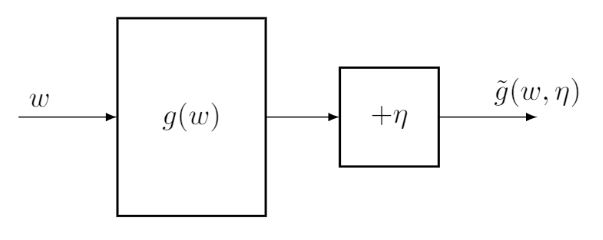

# Stochastic Approximation and Stochastic Gradient Descent

This lesson is very interesting, for telling me a lot about problems in deep learning optimization.

## Motivating example: Mean estimation

To estimate $\mathbb{E}[X]$, based on the idea of Monte Carlo estimation, we can do

$$
\mathbb{E}[X] \approx \bar{x} \doteq \frac{1}{n} \sum_{i=1}^{n} x_i.
$$

$\bar{x} \rightarrow \mathbb{E}[X]$ as $n \rightarrow \infin$ according to the law of large numbers. 

This is just a *non-incremental* method to calculate $\bar{x}$. The drawback is that we have to wait until all of the samples are collected.

Another *incremental* method can be deriviated as follows.

$$
w_{k+1} \doteq \frac{1}{k} \sum_{i=1}^{k} x_i, \quad k=1,2,\dots
$$

$$
w_k = \frac{1}{k-1} \sum_{i=1}^{k-1} x_i, \quad k=2, 3, \dots
$$

$$
\begin{align} w_{k+1} = \frac{1}{k} \sum_{i=1}^{k} x_i = \frac{1}{k} \left( \sum_{i=1}^{k-1} x_i + x_k \right) = \frac{1}{k} ((k-1)w_k + x_k) = w_k - \frac{1}{k}(w_k - x_k). \end{align}
$$

Then, we obtain the following incremental algorithm:

$$
w_{k+1} = w_k - \frac{1}{k}(w_k - x_k).
$$

The advantage of this algorithm is that the average can be immediately calculated every time we receive a sample. Though the begining approximation may not be accurate, better than nothing.

## Robbins-Monro algorithm

Do not require the expression of objective function as opposed to gradient-based ones.

### Problem formulation

Suppose we want to find the root of the equation

$$
g(w) = 0
$$

This is a common formulation in optimization problems, e.g., $J(\omega)$ is an objective funtion to be optimized, then the optimization problem can be converted to solving $g(w) \doteq \nabla_{w} J(w) = 0.$

Since we suppose the expression of $g$ is unknown, we can only obtain a noisy observation of $g(\omega)$:

$$
\tilde{g}(w, \eta) = g(w) + \eta,
$$

where $\eta \in \mathbb{R}$ is the observation error. Our aim is to solve $g(\omega) = 0$ using $\omega$ and $\tilde{g}$.

An illustration of the problem of solving $g(w) = 0$ from $w$ and $\tilde{g}$.

The RM algorithm that can solve $g(w) = 0$ is

$$
w_{k+1} = w_k - \alpha_k \tilde{g}(w_k, \eta_k), \quad k=1,2,3,\dots
$$

where $\omega_{k}$ is the $k$th estimate of the root, $\tilde{g}(w_k, \eta_k)$ is the $k$th noisy observation, and $\alpha_k$ is a positive coefficient.

### Convergence properties

An example for illustrating the convergence of the RM algorithm

**Theorem 6.1** (Robbins-Monro theorem). In the Robbins-Monro algorithm, if

(a) $0 < c_1 \le \nabla_w g(w) \le c_2 \text{ for all } w;$

(b) $\sum_{k=1}^{\infty} a_k = \infty \quad and \quad \sum_{k=1}^{\infty} a_k^2 < \infty;$

(c) $\mathbb{E}[\eta_k | \mathcal{H}_k] = 0 \quad and \quad \mathbb{E}[\eta_k^2 | \mathcal{H}_k] < \infty;$

where $\mathcal{H}_k = \{w_k, w_{k-1}, \dots\}$. Then $\omega_k$ converges to the root $\omega^*$ satisfying $g(w^*) = 0$.

The conditions are explained as follows.

- (a): Left part in the inequality indicates that $g(w)$ is a monotically increasing function. It ensures that the root of $g(w)=0$ exists and is unique. This condition is acceptable because $g(w)$ is commonly the derivative expression of a objective funtion, which is constrained to be a convex function under this condition, a common situation in optimization problems. Right part indicates that the gradient of $g(w)$ is bounded from above.
- (b): The second part requires $a_k$ converges to zero as $k \rightarrow \infin$, and the first part requires that $a_k$ should not converge to zero too fast. This ensures that we can always start optimize from any initial $w$ value.

Specifically, $a_k = \frac{1}{k}$ satisfy the theorem.  In practise, $a_k$ is often selected as a sufficiently small constant, because some errors is acceptable.

### Application to mean estimation

Suppose that

$$
g(w) \doteq w - \mathbb{E}[X].
$$

Then the original problem is to obtain the value of $\mathbb{E}[x]$. This problem is formulated as a root-finding problem to solve $g(w)=0$. The noisy observation that we can obtain is

$$
\begin{align*} \tilde{g}(w,\eta) &= w-x \\ &= w-x+\mathbb{E}[X] - \mathbb{E}[X] \\ &= (w - \mathbb{E}[X]) + (\mathbb{E}[X] - x) \doteq g(w) + \eta, \end{align*}
$$

where $\eta \doteq \mathbb{E}[X] - x$.

The RM algorithm for solving this problem is

$$
w_{k+1} = w_k - \alpha_k \tilde{g}(w_k, \eta_k) = w_k - \alpha_k (w_k - x_k),
$$

if $\alpha_k$ satisfies the condition descripted in theorem 6.1, then $w_k$ converges to $\mathbb{E}[X]$.

## Stochastic gradient descent

Consider the following optimization problem:

$$
\min_w J(w) = \mathbb{E}[f(w, X)],
$$

where $w$ is the parameter to be optimized, and $X$ is a random variable.

### Graident descent

$$
w_{k+1} = w_k - \alpha_k \nabla_w J(w_k) = w_k - \alpha_k \mathbb{E}[\nabla_w f(w_k, X)].
$$

Based on large number law, the expected value can be approximated as

$$
\mathbb{E}[\nabla_w f(w_k, X)] \approx \frac{1}{n} \sum_{i=1}^{n} \nabla_w f(w_k, x_i).
$$

The problem is that it requires all the samples in each iteration.

### Stochastic gradient descent

$$
w_{k+1} = w_k - \alpha_k \nabla_w f(w_k, x_k),
$$

where $x_k$ is the sample collected at time step $k$.

**Theorem 6.4** (Convergence of SGD). For the SGD algorithm, if the following conditions are satisfied, then $w_k$ converges to the root of $\nabla_w \mathbb{E}[f(w, X)] = 0$ almost surely.

$$
\begin{array}{ll}(a) & 0 < c_1 \le \nabla_w^2 f(w,X) \le c_2; \\(b) & \sum_{k=1}^{\infty} a_k = \infty \quad \text{and} \quad \sum_{k=1}^{\infty} a_k^2 < \infty; \\(c) & \{x_k\}_{k=1}^{\infty} \quad \text{are i.i.d.}\end{array}
$$

### Convergence pattern of SGD

Since the stochastic gradient is random, one may ask whether the convergence speed of SGD is slow or random. It’s interesting that i behaves similarly to the regular gradient descent algorithm when the estimate $w_k$ is far from the optimal solution $w^*$. Only when $w_k$ is close to $w^*$, does the convergence of SGD exhibit more randomness, which is significantly important in practise.

An analysis is given below.

We can define *relative error* as

$$
\delta_k \doteq \frac{|\nabla_w f(w_k, x_k) - \mathbb{E}[\nabla_w f(w_k, X)]|}{|\mathbb{E}[\nabla_w f(w_k, X)]|}.
$$

Since $w^*$ is the optimal solution, it holds that $\mathbb{E}[\nabla_w f(w^*, X)] = 0.$ Then, the relative error can be rewritten as

$$
\begin{align} \delta_k = \frac{|\nabla_w f(w_k, x_k) - \mathbb{E}[\nabla_w f(w_k, X)]|}{|\mathbb{E}[\nabla_w f(w_k, X)] - \mathbb{E}[\nabla_w f(w^*, X)]|} = \frac{|\nabla_w f(w_k, x_k) - \mathbb{E}[\nabla_w f(w_k, X)]|}{|\mathbb{E}[\nabla_w^2 f(\tilde{w}_k, X)(w_k - w^*)]|},\end{align}
$$

where the last equality is due to the mean value theorem and $\tilde{w}_k \in [w_k, w^*]$. Suppose that $f$ is strictly convex such that $\nabla_w^2 f \ge c > 0$ for all $w, X$. Then

$$
\begin{align*}|\mathbb{E}[\nabla_w^2 f(\tilde{w}_k, X)(w_k - w^*)]| &= |\mathbb{E}[\nabla_w^2 f(\tilde{w}_k, X)]| |(w_k - w^*)| \\&\ge c|w_k - w^*|.\end{align*}
$$

Substituting

$$
\delta_k \le \frac{|\overbrace{\nabla_w f(w_k, x_k)}^{\text{stochastic gradient}} - \overbrace{\mathbb{E}[\nabla_w f(w_k, X)]}^{\text{true gradient}}|}{\underbrace{c|w_k - w^*|}_{\text{distance to the optimal solution}}}.
$$

The above inequality suggests an interesting convergence pattern of SGD.

Simulation example

### A deterministic formulation of SGD

The formulation of SGD before involves random variables. One may encounter a deterministic formulation of SGD without random variables.

Consider a set of real numbers $\{x_i\}_{i=1}^n$. The optimization problem to be solved is:

$$
\min_w J(w) = \frac{1}{n} \sum_{i=1}^{n} f(w, x_i),
$$

we can convert this deterministic formulation to the stochastic formulation by introducing a random variable. Let $X$ be a random variable defined on the set $\{x_i\}_{i=1}^n$. Suppose that its probability distribution is uniform such that $p(X=x_i)=\frac{1}{n}$. Then, the deterministic optimization problem becomes a stochastic one:

$$
\min_w J(w) = \frac{1}{n} \sum_{i=1}^{n} f(w, x_i) = \mathbb{E}[f(w, X)].
$$

### Note:

1. $x_k$ may repeatedly take the same number since it is sampled randomly.

### BGD, SGD, and mini-batch GD

$$
\begin{align*}w_{k+1} &= w_k - \alpha_k \frac{1}{n} \sum_{i=1}^{n} \nabla_w f(w_k, x_i), && \text{(BGD)} \\w_{k+1} &= w_k - \alpha_k \frac{1}{m} \sum_{j \in \mathcal{I}_k} \nabla_w f(w_k, x_j), && \text{(MBGD)} \\w_{k+1} &= w_k - \alpha_k \nabla_w f(w_k, x_k). && \text{(SGD)}\end{align*}
$$

### Note:

1. Sometimes though the sample sizes of BGD and MBGD are the same, they may collect different samples because MBGD may choose duplicated samples due to randomness.