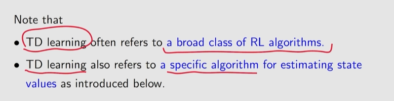

# Temporal-Difference Learning

Similar to Monte Carlo (MC) learning, TD learning is also model-free, but it has some  advantages due to its incremental form.

## TD learning of state values

### Algorithm description

Given a policy $\pi$, our goal is to estimate $v_\pi(s)$ for all $s \in \mathcal{S}$. Suppose that we have some experience samples $(s_0, r_1, s_1, \dots, s_t, r_{t+1}, s_{t+1}, \dots)$ generated following $\pi$. Here, $t$ denotes the time step. The following TD algorithm can estimate the state values using these samples:

$$
v_{t+1}(s_t) = v_t(s_t) - \alpha_t(s_t) \big[ v_t(s_t) - (r_{t+1} + \gamma v_t(s_{t+1})) \big],
$$

$$
v_{t+1}(s) = v_t(s), \quad \text{for all } s \neq s_t,
$$

Attention: $v_{t}(s)$ is a approximation of $v_{\pi}(s)$ at step $t$, they are different.

### Deviration of the TD algorithm

*Prerequisite——Bellman expectation equation*

$$
\begin{aligned}\mathbb{E}[G_{t+1}|S_t = s] = \sum_a \pi(a|s) \sum_{s'} p(s'|s, a) v_\pi(s') = \mathbb{E}[v_\pi(S_{t+1})|S_t = s]. \end{aligned}
$$

$$
v_\pi(s) = \mathbb{E} \big[ R_{t+1} + \gamma G_{t+1} \mid S_t = s \big], \quad s \in \mathcal{S}.
$$

$$
\begin{align}v_{\pi}(s) = \mathbb{E} \big[ R_{t+1} + \gamma v_{\pi}(S_{t+1}) \mid S_t = s \big], \quad s \in \mathcal{S}.\end{align}
$$

The above is the Bellman expactation equation.

Deviration by RM algorithm:

$$
g\big(v_\pi(s_t)\big) \doteq v_\pi(s_t) - \mathbb{E}\big[ R_{t+1} + \gamma v_\pi(S_{t+1}) \mid S_t = s_t \big].
$$

$$
\begin{aligned} g(v_\pi(s_t)) = 0.\end{aligned}
$$

$$
\begin{aligned}
\tilde{g}(v_\pi(s_t)) &= v_\pi(s_t) - \big[r_{t+1} + \gamma v_\pi(s_{t+1})\big] \\
&= \underbrace{\left( v_\pi(s_t) - \mathbb{E}\big[ R_{t+1} + \gamma v_\pi(S_{t+1}) \mid S_t = s_t \big] \right)}_{g(v\pi(s_t))} \\
&\quad + \underbrace{\left( \mathbb{E}\big[ R_{t+1} + \gamma v_\pi(S_{t+1}) \mid S_t = s_t \big] - \big[ r_{t+1} + \gamma v_\pi(s_{t+1}) \big] \right)}_{\eta}.
\end{aligned}
$$

$$
\begin{aligned}
v_{t+1}(s_t)
&= v_t(s_t) - \alpha_t(s_t)\tilde{g}(v_t(s_t)) \\
&= v_t(s_t) - \alpha_t(s_t)\left( v_t(s_t) - [r_{t+1} + \gamma v_\pi(s_{t+1})] \right),
\end{aligned}
$$

Now, you can see that the right-hand of the above equation has the term $v_{\pi}(s_{t+1})$, which is different from the original TD algorithm.They are equal naturally (proof see books).

### Property Analysis

$$
\begin{equation}\underbrace{v_{t+1}(s_t)}_{\text{new estimate}} = \underbrace{v_t(s_t)}_{\text{current estimate}} - \alpha_t(s_t) [ \overbrace{v_t(s_t) - (\underbrace{r_{t+1} + \gamma v_t(s_{t+1})}_{\text{TD target } \bar{v}_t})}^{\text{TD error } \delta_t} ],\end{equation}
$$

Specifically, TD error refers to the difference between $v_{t}$  and $v_{\pi}$, because when they are equal, TD error will be 0.

The foundamental idea of TD learning is to correct our current estimate of the state value based on the newly obtained informatino. (indicate new information obtained from the experience sample $(s_t, r_{t+1}, s_{t+1})$ .)

Both of the above are model-free methods. TD has larger bias (due to stochastic initial values) and smaller variance (due to less varibles) 

### Convergence analysis

See books.

Moreover, TD algorithm in this section can only estimate the state values of a given policy. To find optimal policies, we still need to further calculate the action values and then conduct policy improvement.

## TD learning of action values: Sarsa

### Algorithm description

Given a policy $\pi$, our goal is to estimate the action values. Suppose that we have some experience samples generated following $\pi$: $(s_0, a_0, r_1, s_1, a_1, \dots, s_t, a_t, r_{t+1}, s_{t+1}, a_{t+1}, \dots)$.

We can use the following *Sarsa* algorithm to estimate the action values:

$$
\begin{equation}q_{t+1}(s_t, a_t) = q_t(s_t, a_t) - \alpha_t(s_t, a_t)\left[ q_t(s_t, a_t) - (r_{t+1} + \gamma q_t(s_{t+1}, a_{t+1})) \right]\end{equation}
$$

$$
q_{t+1}(s, a) = q_t(s, a), \quad \text{for all } (s, a) \neq (s_t, a_t),
$$

where $t = 0, 1, 2, \dots$ and $\alpha_t(s_t, a_t)$ is the learning rate. Here, $q_t(s_t, a_t)$ is the estimate of $q_\pi(s_t, a_t)$. At time $t$, only the q-value of $(s_t, a_t)$ is updated, whereas the q-values of the others remain the same.

state-action-reward-state-action—Sarsa, which is the action-value version of TD-learning. Sarsa is a stochastic approximation algorithm for solving the Bellman equation of a given policy:

$$
q_{\pi}(s, a) = \mathbb{E} [R + \gamma q_{\pi}(S', A') | s, a], \quad \text{for all } (s, a).
$$

### Convergence analysis

see books.

### Optimal policy learning via Sarsa

The Sarsa algorithm above can only estimate the action values of a given policy. To  find optimal policies, we can combine it with a policy improvement step.

Each iteration has two steps. The first step is to update the q-value of visited the state-action pair. The second step is to update the policy.

### Example

## TD learning of action values: Expected Sarsa

$$
\begin{aligned}q_{t+1}(s_t, a_t) &= q_t(s_t, a_t) - \alpha_t(s_t, a_t) \left[ q_t(s_t, a_t) - (r_{t+1} + \gamma \mathbb{E}[q_t(s_{t+1}, A)]) \right], \\q_{t+1}(s, a) &= q_t(s, a), \quad \text{for all } (s, a) \neq (s_t, a_t),\end{aligned}
$$

where

$$
\mathbb{E}[q_t(s_{t+1}, A)] = \sum_a \pi_t(a|s_{t+1})q_t(s_{t+1}, a) \doteq v_t(s_{t+1})
$$

Expected Sarsa can be viewed as  a stochastic approximation algorithm for solving the following equation, which is the Bellman equation:

$$
\begin{aligned}q_\pi(s, a) = \mathbb{E}\left[ R_{t+1} + \gamma \mathbb{E}[q_\pi(S_{t+1}, A_{t+1}) | S_{t+1}] \big| S_t = s, A_t = a \right], \quad \text{for all } s, a.\end{aligned}
$$

## TD learning of action values: n-step Sarsa

$$
\begin{aligned}\text{Sarsa} \longleftarrow \quad G_t^{(1)} &= R_{t+1} + \gamma q_\pi(S_{t+1}, A_{t+1}), \\G_t^{(2)} &= R_{t+1} + \gamma R_{t+2} + \gamma^2 q_\pi(S_{t+2}, A_{t+2}), \\&\vdots \\n\text{-step Sarsa} \longleftarrow \quad G_t^{(n)} &= R_{t+1} + \gamma R_{t+2} + \dots + \gamma^n q_\pi(S_{t+n}, A_{t+n}), \\&\vdots \\\text{MC} \longleftarrow \quad G_t^{(\infty)} &= R_{t+1} + \gamma R_{t+2} + \gamma^2 R_{t+3} + \gamma^3 R_{t+4} \dots\end{aligned}
$$

It should be noted that $G_t = G_t^{(1)} = G_t^{(2)} = G_t^{(n)} = G_t^{(\infty)}$.

### Definition of n-step Sarsa

$$
\begin{aligned}q_{t+n}(s_t, a_t) = & \, q_{t+n-1}(s_t, a_t) \\& - \alpha_{t+n-1}(s_t, a_t) \left[ q_{t+n-1}(s_t, a_t) - (r_{t+1} + \gamma r_{t+2} + \dots + \gamma^n q_{t+n-1}(s_{t+n}, a_{t+n})) \right],\end{aligned}
$$

We have to wait util time $t + n$ to update the q-value of $(s_{t}, a_{t})$, so it’s a special online algorithm.

In particular, if $n$ is selected as a large number, $n$-step Sarsa is close to MC learning:  the estimate has a relatively high variance but a small bias.

## TD learning of action values: Q-learning

### Algorithm Description

$$
\begin{aligned}
q_{t+1}(s_t, a_t) &= q_t(s_t, a_t) - \alpha_t(s_t, a_t) \left[ q_t(s_t, a_t) - \left( r_{t+1} + \gamma \max_{a \in \mathcal{A}(s_{t+1})} q_t(s_{t+1}, a) \right) \right], \\
q_{t+1}(s, a) &= q_t(s, a), \quad \text{for all } (s, a) \neq (s_t, a_t),
\end{aligned}
$$

Q-learning algorithm is only different from Sarsa in terms of their TD target. Q-learning is a stochastic approximation for solving the following equation:

$$
q(s, a) = \mathbb{E} \left[ R_{t+1} + \gamma \max_{a} q(S_{t+1}, a) \middle| S_t = s, A_t = a \right].
$$

The above is the *Bellman optimality equation* in terms of action values. Proof see in books.

### On-policy and Off-policy

a behavior policy and a target  policy: The *behavior policy* is the one used to generate experience samples. The *target  policy* is the one that is constantly updated to converge to an optimal policy.

When the  behavior policy is the same as the target policy, such a learning process is called **on-policy**.  Otherwise, when they are different, the learning process is called **off-policy**.

on的优势是可以从其他策略生成的经验样本中学习最优策略，而如果其他策略是一个具有很强探索性的策略，那么学习效率将得到大大提高

**Online/offline:** Online learning refers to the case where the agent updates the values and policies while  interacting with the environment. Offline learning refers to the case where the agent updates the values and policies using pre-collected experience data without interacting with  the environment.

On-policy可以是online的（蒙特卡洛的on-policy是离线的），off-policy既可以是online也可以是offline

Attention, target policy in off-policy version of Q-learning can be purely greedy rather than $\epsilon$greedy, because it is not used to generate samples and hence is not required to be exploratory.

## A unified viewpoint

TD algorithms can be expressed in a unified expression:

$$
q_{t+1}(s_t, a_t) = q_t(s_t, a_t) - \alpha_t(s_t, a_t)[q_t(s_t, a_t) - \bar{q}_t],
$$

where $\bar{q}_t$ is the TD target. Different TD target have different $\bar{q}_t$.

