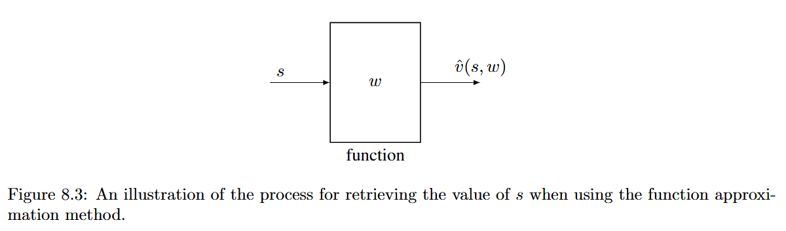

# Value Function Methods

The update of w also affects the values of some other states even though these states have not been visited.

## TD learning of state values based on function  approximation

### Objective function

$$
J(w)=\mathbb{E}\left[\left(v_{\pi}(S)-\hat{v}(S,w)\right)^2\right],
$$

We can estimate the espectation by calculating average value of all states:

$$
J(w)=\frac{1}{n}\sum_{s\in S}\left(v_{\pi}(s)-\hat{v}(s,w)\right)^2,
$$

Or under the hyposis that $S$ satisfies stationary distribution:

$$
J(w)=\sum_{s\in S} d_{\pi}(s)\left(v_{\pi}(s)-\hat{v}(s,w)\right)^2,
$$

### Optimization algorithms

We can use the gradient descent algorithm:

$$
w_{k+1}=w_k-\alpha_k\nabla_w J(w_k),
$$

the stochastic gradient descent if the objective function before is:

$$
w_{t+1}=w_t+\alpha_t\left(v_{\pi}(s_t)-\hat{v}(s_t,w_t)\right)\nabla_w\hat{v}(s_t,w_t),
$$

Notably, it is not implementable because it requires the true state value $v_{\pi}$, which is unknown and must be estimated. We can replace $v_{\pi}(s_t)$ with an approximation to make the algorithm implementable. The following two methods can be used to do so.

- Mont Carlo method
    
    Let $g_t$ be the discounted return starting from $s_t$.
    
    $$
    w_{t+1}=w_t+\alpha_t\left(g_t-\hat{v}(s_t,w_t)\right)\nabla_w \hat{v}(s_t,w_t).
    $$
    
- TD method
    
    $$
    w_{t+1}=w_t+\alpha_t\left[r_{t+1}+\gamma \hat{v}(s_{t+1},w_t)-\hat{v}(s_t,w_t)\right]\nabla_w \hat{v}(s_t,w_t).
    $$
    

### Selection of function approximators

Omitted, directly jump to nueral network based approximators later

## TD learning of action values based on function  approximation

### Sarsa with function approximation

q instead of v.

Moreover, the implementation in Algorithm 8.2 aims to solve the task of finding a good path to the target state from a prespecified starting state. As a result, it cannot find the optimal policy for every state. However, if sufficient experience data are available, the implementation process can be easily adapted to find optimal policies for every state.

### Q-learning with function approximation

q_max instead of q

## Deep Q-learning

Objective function (can be viewed as the squared Bellman optimality error):

$$
J = \mathbb{E}\left[\left(R + \gamma \max_{a \in \mathcal{A}(S')} \hat{q}(S',a,w)- \hat{q}(S,A,w)\right)^2\right].
$$

two networks optimization method:

$$
J=\mathbb{E}\left[\left(R+\gamma \max_{a\in\mathcal{A}(S')}\hat{q}(S',a,w_T)-\hat{q}(S,A,w)\right)^2\right].
$$

When $w_T$ is fixed, the gradient of $J$ is

$$
\nabla_w J=-\mathbb{E}\left[\left(R+\gamma\max_{a\in\mathcal{A}(S')}\hat{q}(S',a,w_T)-\hat{q}(S,A,w)\right)\nabla_w\hat{q}(S,A,w)\right]
$$

- Here, we use a mini-batch ( $\{(s,a,r,s')\}$) of samples to train a network instead of using a single sample to update the main network.
- ***experience replay***: After we have collected some experience samples, we do not use these samples in the order they were collected. Instead, we store them in a dataset called the replay buffer. Every time we update the main network, we can draw a mini-batch of experience samples from the replay buffer. The draw of samples, or called experience replay, should follow a **uniform  distribution**.