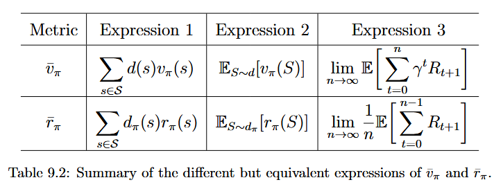

# Policy Gradient Methods

When represented as a table, a policy is defined as optimal if it can maximize every state value. When represented by a function, a policy is defined as optimal if it can maximize certain scalar metrics.

- What metrics should be used?
- How to calculate the gradients of the metrics?
- How to use experience samples to calculate the gradients?

## Metrics for defining optimal policies

### Average state value:

$$
\bar{v}_\pi=\sum_{s\in\mathcal{S}}d(s)v_\pi(s)
$$

$$
v_\pi=\mathbb{E}_{S\sim d}\left[v_\pi(S)\right].
$$

d is the distribution of s。

equivalent expressions：

$$
J(\theta)=\lim_{n\to\infty}\mathbb{E}\left[\sum_{t=0}^{n}\gamma^t R_{t+1}\right]=\mathbb{E}\left[\sum_{t=0}^{\infty}\gamma^t R_{t+1}\right].
$$

### Average reward (average one-step reward):

$$
\bar{r}_\pi \doteq \sum_{s\in\mathcal{S}} d_\pi(s)r_\pi(s)= \mathbb{E}_{S\sim d_\pi}\left[r_\pi(S)\right],
$$

$$
r_\pi(s) \doteq \sum_{a\in\mathcal{A}} \pi(a\mid s,\theta)r(s,a)= \mathbb{E}_{A\sim\pi(s,\theta)}\left[r(s,A)\mid s\right]
$$

$$
\bar{r}_\pi=(1-\gamma)\bar{v}_\pi.
$$

See above, these two metrics are equal, and the basic idea of policy gradient methods is to search for the optimal parameters to maximize these metrics.

## Gradients of the metrics

**Theorem 9.1** (Policy gradient theorem). The gradient of $J(\theta)$ is 

$$
\nabla_\theta J(\theta)=\sum_{s\in\mathcal{S}}\eta(s)\sum_{a\in\mathcal{A}}\nabla_\theta\pi(a|s,\theta)q_\pi(s,a),
$$

where $\eta$ is a state distribution and $\nabla_\theta\pi$ is the gradient of $\pi$ with respect to $\theta$. Moreover, the above equation has a compact form expressed in terms of expectation:

$$
\nabla_\theta J(\theta)=\mathbb{E}_{S\sim\eta,A\sim\pi(S,\theta)}\left[\nabla_\theta \ln\pi(A|S,\theta)q_\pi(S,A)\right],
$$

$$
\nabla_\theta \ln \pi(a|s,\theta)=\frac{\nabla_\theta\pi(a|s,\theta)}{\pi(a|s,\theta)}.
$$

See Prooves in book.

## Monte Carlo policy gradient (REINFORCE)

The gradient-**ascent** algorithm for maximizing $J(\theta)$ is:

$$
\theta_{t+1}=\theta_t+\alpha\nabla_\theta J(\theta_t) \\ 
=\theta_t+\alpha\mathbb{E}\left[\nabla_\theta\ln\pi(A|S,\theta_t)q_\pi(S,A)\right],
$$

replace the true gradient with a stochastic gradient:

$$
\theta_{t+1}=\theta_t+\alpha\nabla_\theta\ln\pi(a_t|s_t,\theta_t)q_t(s_t,a_t),
$$

equivalent expression:

$$
\theta_{t+1}=\theta_t+\alpha
\underbrace{\left(\frac{q_t(s_t,a_t)}{\pi(a_t|s_t,\theta_t)}\right)}_{\beta_t}
\nabla_\theta\pi(a_t|s_t,\theta_t),
$$

$$
\theta_{t+1}=\theta_t+\alpha\beta_t\nabla_\theta\pi(a_t|s_t,\theta_t).
$$

