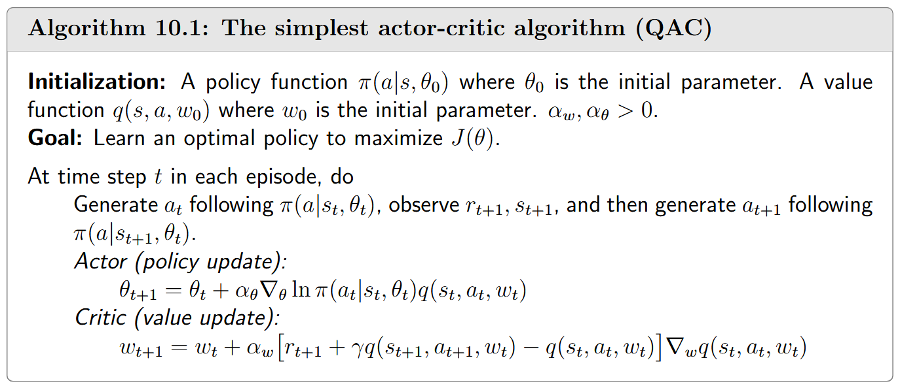

# Actor-Critic Methods

## The simplest actor-critic algorithm (QAC)

Recall that the idea of the policy gradient method is to search for an optimal policy by maximizing a scalar metric $J(\theta)$. The gradient-ascent algorithm for maximizing $J(\theta)$ is 

$$
\theta_{t+1}=\theta_t+\alpha\nabla_\theta J(\theta_t)
\\
=\theta_t+\alpha\mathbb{E}_{S\sim\eta,A\sim\pi}\left[\nabla_\theta\ln\pi(A|S,\theta_t)q_\pi(S,A)\right],
$$

we can use a stochastic gradient to approximate it:

$$
\theta_{t+1}=\theta_t+\alpha\nabla_\theta\ln\pi(a_t|s_t,\theta_t)q_t(s_t,a_t).
$$

- If $q_{t}(s_t, a_t)$ is estimated by Monte Carlo learning, the corresponding algorithm is called *REINFORCE* or *Monte Carlo policy gradient*, which has already been introduced in last chapter.
- If $q_{t}(s_t, a_t)$ is estimated by TD learning, the corresponding algorithms are usually called ***actor-critic**.* Therefore, actor-critic methods can be obtained by incorporating TD-based value estimation into policy gradient methods.

The critic corresponds to the value update step via the Sarsa algorithm.

## Advantage actor-critic (A2C)

**The core idea of this algorithm is to introduce a baseline to reduce estimation variance.**

### Baseline invariance

Policy gradient is invariant to an additional baseline:

$$
\mathbb{E}_{S\sim\eta,A\sim\pi}\left[\nabla_\theta\ln\pi(A|S,\theta_t)q_\pi(S,A)\right]=\mathbb{E}_{S\sim\eta,A\sim\pi}\left[\nabla_\theta\ln\pi(A|S,\theta_t)\left(q_\pi(S,A)-b(S)\right)\right].
$$

Proof see in books.

The baseline is useful because it can reduce the approximation variance when we use samples to approximate the true gradient.

The optimal baseline that minimizes $var(x)$ is 

$$
b^*(s)=\frac{\mathbb{E}_{A\sim\pi}\left[\left\|\nabla_\theta\ln\pi(A|s,\theta_t)\right\|^2q_\pi(s,A)\right]}{\mathbb{E}_{A\sim\pi}\left[\left\|\nabla_\theta\ln\pi(A|s,\theta_t)\right\|^2\right]},\quad s\in\mathcal{S}.
$$

Although the baseline above is optimal, it is too complex to be useful in practice. We can obtain a suboptimal baseline that has a concise expression:

$$
b^*(s)=\mathbb{E}_{A\sim\pi}\left[q_\pi(s,A)\right]=v_\pi(s),\quad s\in\mathcal{S}.
$$

This suboptimal baseline is the state value.

### Algorithm description

$$
\theta_{t+1}=\theta_t+\alpha\mathbb{E}\left[\nabla_\theta\ln\pi(A|S,\theta_t)\left[q_\pi(S,A)-v_\pi(S)\right]\right]
\\
\doteq\theta_t+\alpha\mathbb{E}\left[\nabla_\theta\ln\pi(A|S,\theta_t)\delta_\pi(S,A)\right].
$$

Here, 

$$
\delta_\pi(S,A)\doteq q_\pi(S,A)-v_\pi(S)
$$

is called the *advantage function*, which reflects the advantage of one action over the others. If 

$\delta_\pi(s,a)>0$, it means that the corresponding action has a greater value than the mean value.

Stochastic version is:

$$
\theta_{t+1}=\theta_t+\alpha\nabla_\theta\ln\pi(a_t|s_t,\theta_t)\left[q_t(s_t,a_t)-v_t(s_t)\right]
\\
=\theta_t+\alpha\nabla_\theta\ln\pi(a_t|s_t,\theta_t)\delta_t(s_t,a_t),
$$

It should be noted that the advantage function in this implementation is approximated by the TD error:

$$
q_t(s_t,a_t)-v_t(s_t)\approx r_{t+1}+\gamma v_t(s_{t+1})-v_t(s_t).
$$

One merit of using the TD error is that we only need to use a single neural network to represent $v_{\pi}(s)$. In additino, it is notable that the policy $\pi(\theta_t)$ is stochastic and hence exploratory. Therefore, it can be directly used to generate experience samples without relying on techniques such as ε-greedy.

## Off-policy actor-critic

### Importance sampling

If we sampled x from distribution $p_1$ but want to estimate $\mathbb{E}_{X\sim p_0}[X]$, we can employ the following equatio

$$
\mathbb{E}_{X\sim p_0}[X]=\sum_{x\in\mathcal{X}}p_0(x)x=\sum_{x\in\mathcal{X}}p_1(x)\frac{p_0(x)}{p_1(x)}x=\mathbb{E}_{X\sim p_1}[f(X)].
$$

$$
f(x)=\frac{p_0(x)}{p_1(x)}x
$$

$$
\mathbb{E}_{X\sim p_0}[X]=\mathbb{E}_{X\sim p_1}[f(X)]\approx \bar{f}=\frac{1}{n}\sum_{i=1}^{n}f(x_i)=\frac{1}{n}\sum_{i=1}^{n}\frac{p_0(x_i)}{p_1(x_i)}x_i.
$$

$\frac{p_0(x_i)}{p_1(x_i)}$ is importance weight.

When $p_0(x_i)\geq p_1(x_i)$, $x_i$ can sampled more frequently by $p_0$ but less frequently by $p_1$. In this case, the importance weight, which is greater than one, emphasizes the importance of this sample.

### The off-policy policy gradient theorem

**Theorem 10.1 (Off-policy policy gradient theorem).** In the discounted case where $\gamma \in (0,1)$, the gradient of $J(\theta)$ is

$$
\nabla_\theta J(\theta)=\mathbb{E}_{S\sim\rho,A\sim\beta}\left[\underbrace{\frac{\pi(A|S,\theta)}{\beta(A|S)}}_{\text{importance weight}}\nabla_\theta\ln\pi(A|S,\theta)q_\pi(S,A)\right].
$$

### Algorithm description

## Deterministic actor-critic

See in books.